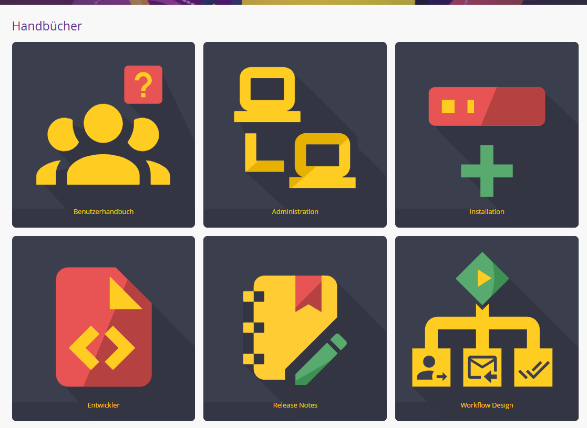

Inhaltsverzeichnis
- [Allgemein](#allgemein)
- [Definition der Versionierung](#definition-der-versionierung)
- [Architektur: Trait-basiertes Design](#architektur-trait-basiertes-design)
  - [Die funktionalen Bausteine (Traits)](#die-funktionalen-bausteine-traits)
  - [Infrastruktur \& Hilfsmittel](#infrastruktur--hilfsmittel)
    - [Abhängigkeitsmatrix](#abhängigkeitsmatrix)
- [Funktionsregistrierung](#funktionsregistrierung)
  - [Pedant (Rechnung auslesen)](#pedant-rechnung-auslesen)
    - [Aufgaben der Systemaktivität (PHP-Code)](#aufgaben-der-systemaktivität-php-code)
    - [Aufgaben der KI (Pedant.ai)](#aufgaben-der-ki-pedantai)
  - [fetchData (Rechnung abholen)](#fetchdata-rechnung-abholen)
    - [Aufgaben der Systemaktivität (PHP-Code)](#aufgaben-der-systemaktivität-php-code-1)
    - [Aufgaben der KI (Pedant.ai)](#aufgaben-der-ki-pedantai-1)
  - [documentClassifier (Dokumentenklassifizikation)](#documentclassifier-dokumentenklassifizikation)
    - [Aufgaben der Systemaktivität (PHP-Code)](#aufgaben-der-systemaktivität-php-code-2)
    - [Aufgaben der KI (Pedant.ai)](#aufgaben-der-ki-pedantai-2)
  - [importXXX (Lieferant/ Empfänger/ Kostenstelle importieren)](#importxxx-lieferant-empfänger-kostenstelle-importieren)
    - [Aufgaben der Systemaktivität (PHP-Code)](#aufgaben-der-systemaktivität-php-code-3)
    - [Aufgaben der KI / Plattform (Pedant.ai)](#aufgaben-der-ki--plattform-pedantai)
    - [Unterschiede zwischen den Funktionen](#unterschiede-zwischen-den-funktionen)
- [Zusätzliche Dateien](#zusätzliche-dateien)
  - [Vorstellung von Datei: dialog.xml](#vorstellung-von-datei-dialogxml)
    - [Einrichten der dialog.xml](#einrichten-der-dialogxml)
  - [Vorstellung der Dateien: german.php / english.php](#vorstellung-der-dateien-germanphp--englishphp)
    - [Welche Aufgabe erfüllen german.php / english.php?](#welche-aufgabe-erfüllen-germanphp--englishphp)
    - [Aufgaben der Sprachdateien (Lokalisierung)](#aufgaben-der-sprachdateien-lokalisierung)
    - [Funktionsweise im System](#funktionsweise-im-system)
  - [Vorstellung von Datei: config.php](#vorstellung-von-datei-configphp)
    - [Welche Aufgabe erfüllt config.php?](#welche-aufgabe-erfüllt-configphp)
    - [Aufgaben der Datei config.php (Systemkonfiguration)](#aufgaben-der-datei-configphp-systemkonfiguration)
    - [Logging](#logging)
- [Einrichtung der Systemaktivität](#einrichtung-der-systemaktivität)
  - [Grundlegende systematische Verknüpfungen:](#grundlegende-systematische-verknüpfungen)
  - [Beispiel anhand der Funktion: Rechnung auslesen (pedant)](#beispiel-anhand-der-funktion-rechnung-auslesen-pedant)
    - [Nach Typ sortiert](#nach-typ-sortiert)
  - [Nach Struktur sortiert](#nach-struktur-sortiert)
  - [Beispielwerte](#beispielwerte)
  - [Besonderheiten bei den Systemaktivitäten](#besonderheiten-bei-den-systemaktivitäten)
- [Fußnoten](#fußnoten)

# Allgemein
Für zusätzliche Informationen zu JobRouter Systemaktivitäten siehe in die Dokumentation von JobRouter. Du findest die Dokumentation unter `"Hilfe"` -> `"Handbücher"` -> `"Entwickler"` -> `"Systemaktivität"`





# Definition der Versionierung

Die erste Ziffer steht für grundlegende Systemänderungen, während die zweite Ziffer neue Funktionen bei bestehender Kompatibilität kennzeichnet. Die finale Ziffer signalisiert reine Fehlerbehebungen (Bugfixes), die die Stabilität des Systems verbessern, ohne den Funktionsumfang zu verändern.

| Stelle        | Bezeichnung | Bedeutung                                                   |
| ------------- | ----------- | ----------------------------------------------------------- |
| Erste Ziffer  | Major       | Massive Änderungen oder neue Systemarchitektur.             |
| Zweite Ziffer | Minor       | Neue Features oder Felder, die bestehende Abläufe ergänzen. |
| Dritte Ziffer | Patch       | Kleinere Bugfixes                                           |


# Architektur: Trait-basiertes Design
Die Architektur der Systemaktivität basiert auf dem Prinzip der Separation of Concerns (Trennung von Zuständigkeiten). Anstatt die gesamte Logik in einer einzigen, unübersichtlichen Datei zu bündeln, ist der Code in modulare Traits unterteilt. Diese lassen sich in zwei Kategorien gliedern:

## Die funktionalen Bausteine (Traits)
Diese Traits enthalten die fachliche Hauptlogik für die in der dialog.xml definierten Funktionen.

- **InvoiceTrait.php (pedant)**: Steuert den Lebenszyklus der Rechnungsverarbeitung. Er verwaltet den Upload zur KI (uploadFile) und die zyklische Statusabfrage (checkFile), bis das Dokument finalisiert wurde.

- **DocumentClassifierTrait.php (documentClassifier)**: Spezialisierter Baustein für die Dokumentenklassifizierung. Er kommuniziert mit der Classifier-API von Pedant, um Dokumenttypen (z. B. Lieferschein vs. Rechnung) zu bestimmen.

- **FetchTrait.php (fetchData)**: Verantwortlich für den Batch-Abruf. Er identifiziert fertig verarbeitete Dokumente auf der Plattform und berücksichtigt dabei konfigurierte Arbeitszeiten und Wochenenden, um die Workflow-Schritte in JobRouter wieder zu aktivieren.

- **ImportTrait.php (import...CSV)**: Regelt den Stammdatenabgleich. Er extrahiert Daten (Kreditoren, Kostenstellen etc.) aus JobRouter-Tabellen, generiert CSV-Dateien und übermittelt diese an die Pedant-API.

## Infrastruktur & Hilfsmittel
Diese Bausteine bilden das technische Fundament und werden von den funktionalen Traits im Hintergrund genutzt.

- **ApiTrait.php**: Die unterste Kommunikationsebene. Hier erfolgt die technische Abwicklung der HTTP-Requests (cURL). Der Trait verwaltet Endpunkt-URLs, API-Header, die Authentifizierung via API-Key, die Umschaltung zwischen Demo- und Produktivumgebung sowie die Basis-Fehlerbehandlung bei Übertragungsfehlern.

- **DataMapperTrait.php**: Fungiert als technisches "Übersetzungsbüro". Dieser Trait zerlegt die komplexen JSON-Antworten der API und verteilt die Werte (Positionen, Steuerbeträge, Audit-Trail) strukturiert in die JobRouter-Variablen und Untertabellen.

- **LoggerTrait.php**: Das zentrale Diagnose-Werkzeug. Er schreibt detaillierte Protokolle in vier Stufen (DEBUG, INFO, WARNING, ERROR), legt tägliche Logdateien unter `logs/log` an, versieht jede Zeile mit einem Incident-Tag und bereinigt alte Dateien automatisch.

- **HelperTrait.php**: Enthält allgemeine Hilfsfunktionen. Ein Kernaspekt ist die automatische Erkennung des Datenbanktyps (MySQL oder MSSQL), um SQL-Abfragen innerhalb der Systemaktivität dynamisch an die jeweilige Umgebung anzupassen.

### Abhängigkeitsmatrix

Die folgende Tabelle zeigt, welche funktionalen Bausteine auf welche Infrastruktur-Traits zurückgreifen:

| Funktion (Trait)          | Benötigt ApiTrait? | Benötigt DataMapper? | Benötigt LoggerTrait? | Benötigt HelperTrait? |
| ------------------------- | ------------------ | -------------------- | --------------------- | --------------------- |
| InvoiceTrait (Rechnungen) | Ja                 | Ja                   | Ja                    | Nein                  |
| FetchTrait (Batch-Abruf)  | Ja                 | Nein                 | Ja                    | Ja                    |
| ImportTrait (Stammdaten)  | Ja                 | Nein                 | Ja                    | Nein                  |
| DocumentClassifierTrait   | Ja                 | Nein                 | Ja                    | Nein                  |


# Funktionsregistrierung

In unserem Fall lassen sich in der dialog.xml 6 Funktionen wiederfinden:

- pedant
- fetchData
- documentClassifier
- importVendorCSV
- importRecipientCSV
- importCostCenterCSV

## Pedant (Rechnung auslesen)
Die primäre Aufgabe dieser Funktion ist die automatisierte Extraktion von Rechnungsinformationen. Sie sorgt dafür, dass physische Dokumente (PDFs) in strukturierte Daten umgewandelt werden, die JobRouter direkt in Prozess- oder Untertabellen weiterverarbeiten kann.

Hierbei findet eine strikte Aufgabenteilung zwischen der lokalen Systemaktivität (PHP) und der externen KI (Pedant.ai) statt:

### Aufgaben der Systemaktivität (PHP-Code)

- Vorbereitung: Auslesen der API-Keys und Validierung der Eingabedatei (z.B. Dateigröße prüfen).

- Datenübertragung: Sicherer Versand des Dokuments per HTTPS/cURL an die Pedant-API.

- Prozesssteuerung: Verwaltung der Wiedervorlage (Resubmission) in JobRouter, damit der Workflow wartet, während die KI arbeitet.

- Zustandsüberwachung: Prüfung des aktuellen Verarbeitungsstatus (z.B. processing, reviewed).

- Datenmapping: Entgegennahme der JSON-Ergebnisse und technisches Schreiben dieser Werte in die JobRouter-Variablen und Untertabellen (via DataMapperTrait).

- Cleanup: Löschen von temporären Dateien und Aufräumen der Logs nach Abschluss.

### Aufgaben der KI (Pedant.ai)

- OCR-Verarbeitung: Optische Zeichenerkennung, um Text aus Bilddaten oder PDFs lesbar zu machen.

- Kontext-Analyse: Identifikation, welche Zahl ein Datum, eine Rechnungsnummer oder ein Bruttobetrag ist.

- Stammdatenabgleich: Erkennung von Kreditor (Vendor) und Debitor (Recipient) basierend auf dem Briefkopf.

- Positionsextraktion: Auslesen einzelner Rechnungspositionen inklusive Mengen, Einzelpreisen und Steuererläuterungen.

- Validierung: Prüfung der mathematischen Korrektheit (z.B. Summe der Positionen vs. Gesamtbetrag) und Erkennung von Unstimmigkeiten.

## fetchData (Rechnung abholen)
Die Hauptaufgabe ist die Synchronisation zwischen dem Fertigstellungsstatus bei Pedant und den wartenden Workflow-Schritten in JobRouter. Sie stellt sicher, dass Prozesse nicht unnötig lange im Status "Wiedervorlage" verbleiben, wenn die menschliche Prüfung (Review) oder die KI-Analyse bereits abgeschlossen wurde.

Hierbei findet eine strikte Aufgabenteilung statt:

### Aufgaben der Systemaktivität (PHP-Code)

- Zeitsteuerung (Scheduling): Berechnung des nächsten Abholzeitpunkts basierend auf Konfigurationsparametern wie Arbeitszeiten (worktime) und Wochenend-Regelungen (weekend).

- Batch-Abfrage: Systematisches Durchlaufen der Pedant-API-Listen (Pagination), um alle Dokumente mit Status wie reviewed, exported oder rejected zu finden.

- Datenbank-Abgleich: Identifikation der zugehörigen JobRouter-Prozessinstanz anhand der von Pedant zurückgegebenen IDs.

- Triggering: Ausführung von SQL-Updates (JRINCIDENTS), um das Wiedervorlage-Datum der betroffenen Schritte auf die aktuelle Zeit zu setzen. Dadurch wird der Workflow sofort fortgesetzt.

- Status-Filterung: Entscheidung, welche Dokumente aufgrund ihres Status (z.B. nur reviewed) für einen Import in Frage kommen.

### Aufgaben der KI (Pedant.ai)
- Keine

## documentClassifier (Dokumentenklassifizikation)

Die Hauptaufgabe dieser Funktion ist die Vorklassifizierung von Dokumenten. Sie entscheidet, um welchen Dokumententyp es sich handelt (z. B. Rechnung, Mahnung, Lieferschein) und extrahiert erste Identifikationsmerkmale wie Absender und Empfänger. Dies ermöglicht eine intelligente Steuerung des Workflows in JobRouter (Routing).

### Aufgaben der Systemaktivität (PHP-Code)

- Status-Management: Verwaltung des DC_UPLOADCOUNTER und der DC_DOCUMENTID, um zwischen der Upload-Phase und der Abfrage-Phase zu unterscheiden.

- Datei-Transfer: Übermittlung des Dokuments an den speziellen Classifier-Endpunkt der Pedant-API (/classifier).

- Steuerung der Wiedervorlage: Setzen der Wartezeit basierend auf dem Parameter dc_interval, falls das Ergebnis noch nicht vorliegt.

- Ergebnis-Mapping: Übertragung der Klassifizierungsergebnisse (z. B. documentType, vendorCompanyName) in die JobRouter-Ausgabeparameter und Untertabellen.

- Persistenz: Speicherung des vollständigen Antwort-JSONs in der Variable dc_tempJSON zur weiteren Verwendung im Prozess.

### Aufgaben der KI (Pedant.ai)

- Dokumententyp-Erkennung: Analyse des Layouts und Inhalts, um den Typ des Dokuments zu klassifizieren (z. B. "Invoice", "Credit Note").

- Entitäten-Identifikation: Erkennung von Firmennamen für Kreditor (Vendor) und Debitor (Recipient) allein auf Basis der Klassifizierungs-Logik.

- Datumsextraktion: Identifikation des Belegdatums (issueDate).

- ID-Vergabe: Erzeugung einer eindeutigen documentClassifierNumber für die Referenzierung.

## importXXX (Lieferant/ Empfänger/ Kostenstelle importieren)
Die Hauptaufgabe dieser Funktionen ist die Synchronisation von Stammdaten. Durch den regelmäßigen Export von Daten aus JobRouter und den anschließenden Import in Pedant.ai wird sichergestellt, dass die KI aktuelle Informationen (z. B. Adressdaten, Bankverbindungen oder Kostenstellennummern) besitzt. Dies erhöht die Erkennungsrate und Zuordnungsqualität bei der Dokumentenanalyse signifikant.

### Aufgaben der Systemaktivität (PHP-Code)

- Datenextraktion: Durchführung einer SQL-Abfrage auf die JobRouter-Datenbank, um die aktuell hinterlegten Stammdaten aus den konfigurierten Tabellen zu lesen.

- CSV-Generierung: Umwandlung der Datenbank-Ergebnisse in eine temporäre CSV-Datei, die dem von Pedant geforderten Format entspricht.

- API-Kommunikation: Versand der CSV-Datei als "multipart/form-data" per POST-Request an den jeweiligen API-Endpunkt der Entität.

- Parameter-Handling: Auflösung der Konfiguration, welche Felder überschrieben werden dürfen (Overrides) und welche Tabellenspalten als Quelle dienen.

- Bereinigung: Sicheres Löschen der temporär erzeugten CSV-Dateien vom Server-Dateisystem nach Abschluss des Uploads.

### Aufgaben der KI / Plattform (Pedant.ai)

- Daten-Ingestion: Einlesen und Validieren der hochgeladenen CSV-Struktur.

- Datenbank-Update: Aktualisierung des internen Datenbestands für den jeweiligen API-Key.

- Optimierung der Erkennung: Nutzung der neuen Stammdaten als Referenzwerte, um bei zukünftigen OCR-Analysen z. B. einen Kreditor anhand seiner IBAN oder seines Namens zweifelsfrei zu identifizieren.

### Unterschiede zwischen den Funktionen

Obwohl der Ablauf identisch ist, unterscheiden sich die Funktionen in folgenden Punkten:

- Ziel-Endpunkte: Jede Funktion spricht einen spezifischen API-Endpunkt an (z. B. /vendors/import für Kreditoren, /recipients/import für Debitoren).

- Dateinamen: Die temporär erzeugten CSV-Dateien haben unterschiedliche Namen (z. B. pedantVendorOutput.csv, pedantRecipientOutput.csv), um Konflikte bei gleichzeitiger Ausführung zu vermeiden.

- Vendor-Speziallogik (Overrides): Nur die Funktion importVendorCSV verfügt über eine zusätzliche Logik für "Override-Fields". Damit kann gesteuert werden, ob die KI bestimmte Felder (wie PLZ, Ort oder Bankverbindung) bei einer Erkennung zwingend durch die hochgeladenen Stammdaten überschreiben soll.

- Konfigurations-Parameter: Die Funktionen nutzen unterschiedliche Input-Parameter aus der dialog.xml, um die Quell-Tabellen in JobRouter zu identifizieren (z. B. vendorTable vs. recipientTable).
  
# Zusätzliche Dateien

## Vorstellung von Datei: dialog.xml

Die Hauptaufgabe dieser Datei ist die Definition der Schnittstellen. Sie legt fest, welche Parameter ein Administrator im Workflow-Designer sehen kann, welche Daten in die Systemaktivität hineinfließen (**Input**) und welche Werte nach der Verarbeitung an den Workflow zurückgegeben werden (**Output**). Ohne diese Datei wäre die Systemaktivität innerhalb der JobRouter-Oberfläche nicht konfigurierbar oder sichtbar.

Aufgaben der Datei dialog.xml (Struktur/Konfiguration)

- Funktionsregistrierung: Deklaration der verfügbaren Methoden (z. B. pedant, fetchData, documentClassifier), damit diese im Designer ausgewählt werden können.

- Parameter-Definition: Festlegung aller Eingabefelder (z. B. API_KEY, INPUTFILE) und Ausgabefelder (z. B. VENDOR_NAME, TOTAL_AMOUNT).

- Datentyp-Validierung: Bestimmung, welche Art von Daten erwartet wird (z. B. file für Dokumente, varchar für Text, int für Zahlen oder checkbox für den Demo-Modus).

- UI-Gestaltung: Definition von Anzeigenamen (name) und Beschreibungen (description), die dem Administrator im JobRouter-Dialog angezeigt werden.

- Pflichtfeld-Steuerung: Festlegung, welche Parameter zwingend ausgefüllt werden müssen (required='yes'), damit die Aktivität korrekt funktioniert.

- Tabellen-Mapping: Konfiguration von Listen-Parametern (UDL), um die Rückgabe von Rechnungspositionen oder Klassifizierungsdetails in JobRouter-Untertabellen zu ermöglichen.
  
### Einrichten der dialog.xml
Die Input als auch Outputfelder, werden über ihre Attribute eingerichtet.

Beispielfelder:

```
 <field id='new' name='NEWVERSION' worktable='no' subtable='no' fixed='yes' datatype='int' required='yes' texttype='checkbox'/>

 <list id="importVendor" name="IMPORTVENDOR" worktable="yes" subtable="no" fixed="yes" datatype="varchar" required="no" udl="yes"/>
```
| Attribut  | Erklärung | Erlaubter Input     |
| --------- | --------- | ------------------- |
| category  |           | `field` oder `list` |
| id        |           |                     |
| name      |           |                     |
| worktable |           |                     |
| subtable  |           |                     |
| fixed     |           |                     |
| datatype  |           |                     |
| requiered |           |                     |
| texttype  |           |                     |
| texttype  |           |                     |


## Vorstellung der Dateien: german.php / english.php

Diese Dateien dienen der Lokalisierung (Übersetzung) der Systemaktivität. Sie stellen sicher, dass die Benutzeroberfläche der Aktivität im JobRouter Designer in der jeweils vom Administrator gewählten Sprache angezeigt wird.

### Welche Aufgabe erfüllen german.php / english.php?

Die Hauptaufgabe dieser Dateien ist die Bereitstellung von Sprachkonstanten. Anstatt Texte (wie Beschreibungen von Eingabefeldern oder Fehlermeldungen) direkt "hart" in die dialog.xml zu schreiben, werden dort Platzhalter (Konstanten) verwendet. Die Übersetzungsdateien füllen diese Platzhalter mit dem tatsächlichen Text in der entsprechenden Sprache.

### Aufgaben der Sprachdateien (Lokalisierung)

- Text-Definition: Zuweisung von lesbaren Texten zu technischen Bezeichnern (z. B. wird aus der Konstante INPUTFILE in der german.php der Text "Eingabedatei").

- Beschreibungen: Bereitstellung von ausführlichen Hilfetexten für den Designer (z. B. Erklärungen, was ein bestimmter "Flag" bewirkt), die dem Administrator beim Drüberfahren mit der Maus angezeigt werden.

- Übersetzung der Rückgabewerte: Definition von Anzeigenamen für die Werte in Dropdown-Menüs oder Auswahllisten innerhalb der Systemaktivitäts-Konfiguration.

- Fehlermeldungs-Templates: Vorhalten von sprachspezifischen Textbausteinen, die im Log oder in der JobRouter-Oberfläche ausgegeben werden können.

### Funktionsweise im System

Wenn JobRouter die dialog.xml lädt, um die Systemaktivität anzuzeigen, prüft das System die Spracheinstellung des aktuell angemeldeten Benutzers.

Ist die Sprache auf Deutsch eingestellt, wird die german.php geladen.

Ist die Sprache auf Englisch eingestellt, wird die english.php geladen.

Alle in der dialog.xml verwendeten Großbuchstaben-Konstanten (z. B. READ_DESC) werden dann durch die entsprechenden Werte aus dem $const-Array der jeweiligen Datei ersetzt.

## Vorstellung von Datei: config.php

Die Datei config.php ist die zentrale Konfigurationsdatei für die Laufzeitumgebung der Systemaktivität. Während die dialog.xml die Einstellungen pro Workflow-Schritt regelt, definiert die config.php systemweite Parameter, die für alle Instanzen der Aktivität gleichermaßen gelten.

### Welche Aufgabe erfüllt config.php?

Die Hauptaufgabe dieser Datei ist die Bereitstellung von globalen Steuerungsparametern des Debuggings. Sie dient vor allem dazu, das Verhalten der Log-Informationen zu beeinflussen, ohne den PHP-Code selbst ändern zu müssen.

### Aufgaben der Datei config.php (Systemkonfiguration)

- Festlegung des Log-Levels: Definition, wie detailliert die Aktivität protokollieren soll (z. B. debug für die Entwicklung oder info für den Produktivbetrieb). Dies wird vom LoggerTrait ausgelesen.

- Unterstützte Werte: `info`[^info], `warning`[^warning], `error`[^error], `debug`[^debug].

- Standardwert der aktuellen Codebasis: `info`.

- Zentraler Parameter-Speicher: Rückgabe eines Konfigurations-Arrays (return [...]), welches von der SystemActivity.php und den Traits eingebunden wird.

Die Hauptaufgabe dieser Datei ist die Bereitstellung von globalen Steuerungsparametern des Debuggings. Sie dient vor allem dazu, das Verhalten der Log-Informationen zu beeinflussen, ohne den PHP-Code selbst ändern zu müssen.

### Logging

- Die Logdateien werden automatisch unter `pedant/logs/log/` angelegt.

- Der Dateiname entspricht immer dem aktuellen Tag im Format `DDMMYYYY.log`.

- Jede Logzeile enthält Zeitstempel, Log-Level, Incident und die eigentliche Nachricht. Optional werden Exception-Details und JSON-Kontext angehängt.

- Das Incident-Tag kommt aus dem Input-Parameter `INCIDENT`. Wenn dieser Wert nicht aufgelöst werden kann, wird `NO_INCIDENT` verwendet.

- Logdateien älter als 7 Tage werden beim Einstieg in die Hauptfunktionen automatisch gelöscht.

- Für Supportfälle sollten nach Möglichkeit immer `INCIDENT`, `TEMPJSON` und `COUNTERSUMMARY` mitgeführt werden.

Details zu Support-Fällen findest du in der [SUPPORT.md-Datei](./SUPPORT.md)

# Einrichtung der Systemaktivität

Es gibt drei Kategorien der einzustellenden Felder:
- **Grundlegende systematische Verknüpfungen**.

Diese sind in jeder Systemaktivität gleich und folgen den selben Parametern


- **Kundenentscheidungen** 

Diese Einstellungen werden mit dem Kunden besprochen und vom ihm entschieden.

- **Datenbank- & Prozesstabellenverknüpfung**

Diese Einstellungen hängen von der Prozesstruktur und benennung der Felder ab


## Grundlegende systematische Verknüpfungen:

Unter diese Kategorie fallen Felder wie `Eingabedatei (inputFile)` oder `API-Key (api_key)`. 
Das Grundprinzip ist bei diesen Feldern, über Mandatenübergreifend das selbe Prinzip.
Diese Felder werden eingerichtet, empfangen den selben Parameter und arbeiten mit diesen Einstellungen.

## Beispiel anhand der Funktion: Rechnung auslesen (pedant)
Für spezifische Informationen zu den Parametern sieh bitte in die [README.md](../README.md)

### Nach Typ sortiert
| Inputparameter                    | Variablenname    | System-Typ                               | Kommentar                                                                                                                        |
| --------------------------------- | ---------------- | ---------------------------------------- | -------------------------------------------------------------------------------------------------------------------------------- |
| `Eingabedatei`                    | `inputFile`      | Grundlegende systematische Verknüpfungen |
| `API-Key`                         | `api_key`        | Grundlegende systematische Verknüpfungen |
| `Demo`                            | `demo`           | Grundlegende systematische Verknüpfungen |
| `Maximale Wiederholungen`         | `maxCounter`     | Grundlegende systematische Verknüpfungen |
| `Flag`                            | `flag`           | Grundlegende systematische Verknüpfungen |
| `Vorgang`                         | `incident`       | Grundlegende systematische Verknüpfungen | Grundsätzlich: `[jr_incident]`                                                                                                   |
| `Maximale Dateigröße`             | `maxFileSize`    | Grundlegende systematische Verknüpfungen |
|                                   |                  |                                          |                                                                                                                                  |
|                                   |                  |                                          |                                                                                                                                  |
| `Flag XML`                        | `flagXML`        | Kundenentscheidungen                     | Wenn der Kunde mit E-rechnungen arbeitet (XML-Rechnungen)                                                                        |
| `ZUGFeRD bearbeiten`              | `zugferd`        | Kundenentscheidungen                     | Wenn der Kunde mit ZUGFeRD-Rechnungen arbeitet                                                                                   |
| `Ausführungsintervall in Minuten` | `intervalOld`    | Kundenentscheidungen                     | Dies ist nur bei Versionen **VOR Version 2.0.0** wichtig. Wenn wir mit der neuen Version arbeiten, ist der Input hier irrelevant |
|                                   |                  |                                          |                                                                                                                                  |
|                                   |                  |                                          |                                                                                                                                  |
| `Mandant Vorauswahl`              | `internalNumber` | Datenbank- & Prozesstabellenverknüpfung  |
| `Neue Version (2 SysAkt)`         | `new`            | Datenbank- & Prozesstabellenverknüpfung  | Diese ist **AB Version 2.0.0** immer auf True                                                                                    |
| `Nachricht`                       | `note`           | Datenbank- & Prozesstabellenverknüpfung  | Dieser Kommentar wird NICHT von der KI verarbeitet, sondern von einem Mitarbeiter gelesen                                        |
| `Lieferanten-Tabelle`             | `vendorTable`    | Datenbank- & Prozesstabellenverknüpfung  |
| `Lieferantenkonfiguration`        | `importVendor`   | Datenbank- & Prozesstabellenverknüpfung  | Dies ist eine "UDL-Liste"                                                                                                        |


## Nach Struktur sortiert
| Inputparameter                    | Variablenname    | System-Typ                               | Kommentar                                                                                                                       |
| --------------------------------- | ---------------- | ---------------------------------------- | ------------------------------------------------------------------------------------------------------------------------------- |
| `Eingabedatei`                    | `inputFile`      | Grundlegende systematische Verknüpfungen |
| `API-Key`                         | `api_key`        | Grundlegende systematische Verknüpfungen |
| `Demo`                            | `demo`           | Grundlegende systematische Verknüpfungen |
| `Mandant Vorauswahl`              | `internalNumber` | Datenbank- & Prozesstabellenverknüpfung  |
| `Maximale Wiederholungen`         | `maxCounter`     | Grundlegende systematische Verknüpfungen |
| `Flag`                            | `flag`           | Grundlegende systematische Verknüpfungen |
| `Flag XML`                        | `flagXML`        | Kundenentscheidungen                     | Wenn der Kunde mit E-rechnungen arbeitet (XML-Rechnungen)                                                                       |
| `Neue Version (2 SysAkt)`         | `new`            | Datenbank- & Prozesstabellenverknüpfung  | Diese ist **AB Version 2.0.0** immer auf True                                                                                   |
| `ZUGFeRD bearbeiten`              | `zugferd`        | Kundenentscheidungen                     | Wenn der Kunde mit ZUGFeRD-Rechnungen arbeitet                                                                                  |
| `Ausführungsintervall in Minuten` | `intervalOld`    | Kundenentscheidungen                     | Dies ist nur bei Versionen **VOR Version 2.0.0** wichtig. Wenn wir mit dem neuen System arbeiten, ist der Input hier irrelevant |
| `Nachricht`                       | `note`           | Datenbank- & Prozesstabellenverknüpfung  | Dieser Kommentar wird NICHT von der KI verarbeitet                                                                              |
| `Vorgang`                         | `incident`       | Grundlegende systematische Verknüpfungen | Grundsätzlich: `[jr_incident]`                                                                                                  |
| `Vorgang`                         | `incident`       | Grundlegende systematische Verknüpfungen | Grundsätzlich: `[jr_incident]`                                                                                                  |
| `Maximale Dateigröße`             | `maxFileSize`    | Grundlegende systematische Verknüpfungen | Grundsätzlich: `[jr_incident]`                                                                                                  |
| `Lieferanten-Tabelle`             | `vendorTable`    | Datenbank- & Prozesstabellenverknüpfung  |
| `Lieferantenkonfiguration`        | `importVendor`   | Datenbank- & Prozesstabellenverknüpfung  |

## Beispielwerte
| Inputparameter                    | Variablenname    | Ressource        | Value                  |
| --------------------------------- | ---------------- | ---------------- | ---------------------- |
| `Eingabedatei`                    | `inputFile`      | `Prozesstabelle` | `INVOICE`              |
| `API-Key`                         | `api_key`        | `Prozesstabelle` | `APIKEY`               |
| `Demo`                            | `demo`           | `Fester Wert`    | `0`                    |
| `Mandant Vorauswahl`              | `internalNumber` | `Prozesstabelle` | `VENDORINTERNALNUMBER` |
| `Maximale Wiederholungen`         | `maxCounter`     | `Fester Wert`    | `20`                   |
| `Flag`                            | `flag`           | `Fester Wert`    | `skip_review`          |
| `Flag XML`                        | `flagXML`        | `Fester Wert`    | `check_extraction`     |
| `Neue Version (2 SysAkt)`         | `new`            | `Fester Wert`    | `0`                    |
| `ZUGFeRD bearbeiten`              | `zugferd`        | `Prozesstabelle` | `1`                    |
| `Ausführungsintervall in Minuten` | `intervalOld`    | `Fester Wert`    | `10`                   |
| `Nachricht`                       | `note`           | `Prozesstabelle` | `CASEWORKERCOMMENT`    |
| `Vorgang`                         | `incident`       | `Fester Wert`    | `[jr_incident]`        |
| `Maximale Dateigröße`             | `maxFileSize`    | `Fester Wert`    | `20`                   |
| `Lieferanten-Tabelle`             | `vendorTable`    | `Prozesstabelle` | `SQLVENDORTABLE`       |

## Besonderheiten bei den Systemaktivitäten

| Funktion                       | Feld                      | Besonderheit                                                                                                                          |
| ------------------------------ | ------------------------- | ------------------------------------------------------------------------------------------------------------------------------------- |
| `Rechnung abholen (fetchData)` | File-ID (fileid)          | Hier müssen wir die Namen der Prozesstabellenfeldes eintragen, wo die Werte gespeicher werden. Wir wollen nicht den Value der File-Id |
| Jede ` `                       | UDL-Liste / Konfiguration | Hier müssen wir die Namen der Prozesstabellenfeldes eintragen, wo die Werte gespeicher werden. **NICHT** den Value der File-Id        |
|                                |                           |                                                                                                                                       |

# Fußnoten

[^info]: Protokolliert den Arbeitsablauf: welche Methode aufgerufen wurde, was abgerufen wurde, Änderungen des Upload-/Prüfstatus, Importfortschritt. Protokolliert außerdem alle Warnungen und Fehler. Gut geeignet für die tägliche Überwachung.

[^warning]: Protokolliert unerwartete Situationen, die keine Funktionsstörungen verursachen: Wiederholungsversuche, fehlgeschlagene Dateibereinigungen, fehlende optionale Daten. Protokolliert außerdem alle Fehler

[^error]: Protokolliert nur Ausnahmen und schwerwiegende Fehler. Minimale Ausgabe. Für den Einsatz in stabilen Produktionsumgebungen.

[^debug]: Protokolliert ALLES: Abfragen, Variablen, Daten nach jeder Änderung, vollständige API-Anfrage- und Antworttexte. Die Protokolldateien wachsen schnell an (GB). Nur zur Fehlerbehebung bei bestimmten Problemen verwenden.